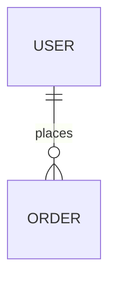

# Data Model Agent Rules

This directory contains logical data model artifacts.

## Standards
- All ER diagrams must be written using Mermaid.
- Entity names must use UPPERCASE singular nouns.
- Attribute names must use snake_case.
- Keep logical model artifacts free from physical DB implementation details.

## Required Files
- `docs/data-model/entities.md`
- `docs/data-model/er-diagram.md`
- `docs/data-model/data-dictionary.md`

Example:

