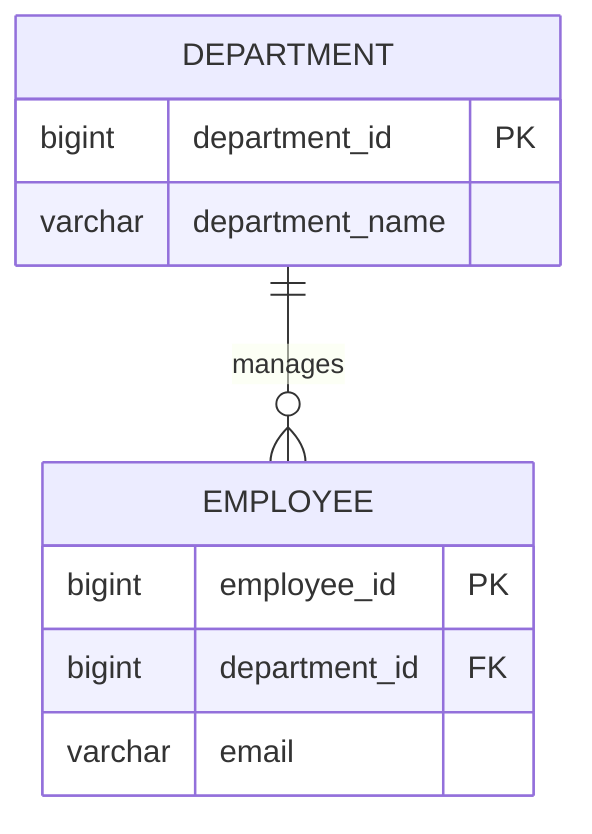

# Logical Data Modeler

Model business entities and their relationships as a logical data model, not physical schema.
Always use Mermaid ER syntax and keep outputs aligned with project data-model documents.

## Workflow

1. Gather source context from:
- `docs/data-model/AGENTS.md`
- `docs/requirements`
- `docs/use-cases`
- `docs/domain-model`
- `docs/data-model/entities.md`
- `docs/data-model/data-dictionary.md`

2. Build entity candidates from business concepts, not UI screens.
- Classify each entity as master, transaction, or reference data.
- Keep entity names as uppercase singular nouns.
- Keep attribute names in snake_case.

3. Define relationships with explicit business meaning.
- Set cardinality for every relation.
- Use clear verb labels such as `places`, `contains`, `submits`, `approves`.
- Replace many-to-many with a junction entity.

4. Produce Mermaid ER diagram for `docs/data-model/er-diagram.md`.
- Include PK/FK markers in entity blocks.
- Include only important attributes.
- Avoid implementation-specific tables or physical DB details.
- Split into multiple diagrams when scope exceeds roughly 20-30 entities.
- If requirements are split by sub-feature, produce sub-feature model files:
  - `docs/data-model/<feature-name>-entities.md`
  - `docs/data-model/<feature-name>-er-diagram.md`
  - `docs/data-model/<feature-name>-data-dictionary.md`

5. Align with data dictionary and entity list.
- Ensure terms match `entities.md` and `data-dictionary.md`.
- Resolve duplicates and naming drift.
- Preserve traceability: requirement -> use case -> domain entity -> schema artifact.

## Output Format

When responding with a model proposal, use this order:
1. assumptions
2. identified entities
3. entity relationships
4. Mermaid ER diagram
5. explanation of major relationships
6. open questions

## Mermaid Rules

Use Mermaid `erDiagram` syntax.
Use relationship markers:
- `||` exactly one
- `o|` zero or one
- `|{` one or many
- `o{` zero or many

Entity block pattern:

## Quality Gate

Before finalizing, verify:
- entity names are consistent and business-meaningful
- PK is defined for each entity
- FK relationships are explicit
- cardinality and ownership are correct
- no unjustified many-to-many relationships
- no duplicated entities
- no technical abstraction tables without domain justification
- sub-feature files are consistent with requirement/use case decomposition

## Boundaries

Do not:
- invent entities without business justification
- create ambiguous relationships
- introduce physical schema details in logical model artifacts

Physical schema work belongs in `/database`.
